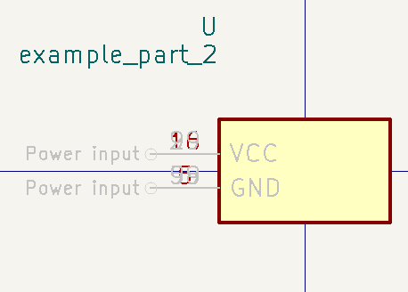

# KiPart

[](https://pypi.python.org/pypi/kipart)

Generate multi-unit schematic symbols for KiCad from a CSV, text, or
Excel file.

## Features

-   Generates schematic part libraries for KiCad from CSV or Excel
    files.
-   Converts one or more lists of pins in a file into a library of 
    multi-unit schematic part symbols.
-   Each row of the file lists the number, name, type, style, and
    unit of a pin along with what side of the symbol to place the pin on.
-   Has several command-line options for controlling the arrangement and
    order of the pins.
-   Pins with the same name (e.g., GND) can be placed at the
    same location so they can all be tied to a net with a single
    connection.
-   Also includes `kilib2csv` for converting schematic part libraries
    into CSV files suitable for input to KiPart.

## Example Use Case

From a user:

I had a very complex library for a microprocessor that I needed to
refactor--- I needed to reorder hundreds of pins in a sane human-usable
format. I thought I was going to have do it by hand in KiCAD\'s
graphical symbol editor. I tried that, got very frustrated with all the
clicking and dragging.

So I then:

-   searched and found this tool,
-   used `kilib2csv` to export my KiCAD lib to CSV,
-   imported the CSV in a spreadsheet program
-   edited the spreadsheet (mainly sorting the pins by function using
    the spreadsheet\'s `sort()` function),
-   exported the spreadsheet back to CSV,
-   used `kipart` to export back to KiCAD.

Boom! Usable part in minutes.

## Installation

Simple enough:

    pip install kipart

This will install two command-line utilities:

-   `kipart`: The main utility for generating schematic symbols from rows of pin data
        stored in CSV or Excel files.
-   `kilib2csv`: A utility for converting existing KiCad libraries into
        CSV files. This is useful for converting existing libraries into a format that
        can be used with KiPart.

## Usage

### KiPart

KiPart is mainly intended to be used as a script:

```
usage: kipart [-h] [-o OUTPUT] [-w] [-m] [-1] [-s {row,num,name}] [-r] [--ccw] [--scrunch] [--side {left,right,top,bottom}] [--type TYPE] [--style STYLE] [--push PUSH] [-a ALT_DELIMITER] [-b]
              [--bundle-style {none,count,range}] [--hide-pin-num] [-j {left,center,right}] [-v]
              input_files [input_files ...]

Convert CSV or Excel files into KiCad symbol libraries

positional arguments:
  input_files           Input symbol pin data CSV or Excel files (.csv, .xlsx, .xls)

options:
  -h, --help            show this help message and exit
  -o, --output OUTPUT   Output KiCad symbol library file (.kicad_sym)
  -w, --overwrite       Allow overwriting of an existing symbol library
  -m, --merge           Merge symbols into an existing library rather than overwriting completely
  -1, --one-symbol      Ignore blank lines rather than starting a new symbol
  -s, --sort {row,num,name}
                        Sort the part pins by their entry order in the CSV file (row), their pin number (num), or their pin name (name)
  -r, --reverse         Sort pins in reverse order
  --ccw                 Arrange pins counter-clockwise around the symbol
  --scrunch             Compress symbol pins on the left/right sides underneath the top/bottom sides
  --side {left,right,top,bottom}
                        Default side for pins without a side specifier
  --type TYPE           Default type for pins without a type specifier (e.g., input, output, bidirectional, passive)
  --style STYLE         Default style for pins without a style specifier (e.g., line, inverted, clock)
  --push PUSH           Position of pin groups on each side (0.0=start, 0.5=centered, 1.0=end)
  -a, --alt-delimiter ALT_DELIMITER
                        Delimiter character for splitting pin names into alternatives
  -b, --bundle          Bundle identically-named power or ground input pins into single schematic pins
  --bundle-style {none,count,range}
                        When bundling pins, selects what is appended to the net name
  --hide-pin-num        Hide pin numbers
  -j, --justify {left,center,right}
                        Sets the justification on visible properties
  -v, --version         show program's version number and exit
```

The input to `kipart` is one or more CSV or Excel files.
These contain the following items:

1.  The part name or number stands alone in the first column of a row.
2.  Part properties are listed on the following rows. Each property begins
    with a property name followed by a colon and the property value. The
    standard properties are:

    -   `Reference`: The reference designator such as `U`.
    -   `Value`: The part value (often the same as the name).
    -   `Footprint`: The part's package type (e.g., QFP, BGA, etc.).
    -   `Datasheet`: A URL to the part's datasheet.
    -   `Description`: A description of the part.
    -   `Keywords`: Keywords for searching for the part.
    -   `Filters`: The footprint filters for the part.
    -   `Locked`: I have no idea what this does...

    You can also list part properties with arbitrary names of your own choosing.

3.  After the properties, the next row contains the column headers. The required
    headers are `Pin` and `Name`. Optional columns are `Unit`,
    `Side`, `Type`, `Style`, and `Hidden`. These can be placed
    in any order and in any column.
4.  Immediately after the column headers, each succeeding row contains the
    following data for one of the part's pins: the pin number, name,
    unit identifier (if the schematic symbol will have multiple units),
    pin type and style. Each of these items should be entered in the
    same column as the corresponding header.
    -   Pin numbers can be either numeric (e.g., `69`) if the part is
        a DIP or QFP, or they can be alphanumeric (e.g., `C10`) for
        BGAs or CSPs. Using a \* character instead
        of a pin number creates non-existent \"gap\"
        pins that can be used to visually separate the pins into groups.
        (This only works when the `-s row` sorting option is selected.)

    -   Pin names can be any combination of letters, numbers and special
        characters (except a comma). If the pin name contains one or more
        delimiter characters specified with the `-a` option, then the name
        will be split at each delimiter and the resulting substrings will
        be entered as alternate pin functions.

    -   The unit identifier can be blank or any combination of letters,
        numbers and special characters (except a comma). A separate unit
        will be generated in the schematic symbol for each distinct unit
        identifier.

    -   The side column specifies the side of the symbol the pin will be placed on.
        The allowable values are:

            -   left
            -   right
            -   top
            -   bottom

    -   The type column specifies the electrical type of the pin.
        The allowable values are:

            -   input, inp, in, clk
            -   output, outp, out
            -   bidirectional, bidir, bi, inout, io, iop
            -   tristate, tri, tri_state, tristate
            -   passive, pass
            -   free
            -   unspecified, un, analog
            -   power_in, pwr_in, pwrin, power, pwr, ground, gnd
            -   power_out, pwr_out, pwrout, pwr_o
            -   open_collector, opencollector, open_coll, opencoll, oc
            -   open_emitter, openemitter, open_emit, openemit, oe
            -   no_connect, noconnect, no_conn, noconn, nc

    -   The style column specifies the graphic representation of the pin.
        The allowable pin styles are:

            -   line, <blank>
            -   inverted, inv, ~, #
            -   clock, clk, rising_clk
            -   inverted_clock, inv_clk, clk_b, clk_n, ~clk, #clk
            -   input_low, inp_low, in_lw, in_b, in_n, ~in, #in
            -   clock_low, clk_low, clk_lw, clk_b, clk_n, ~clk, #clk
            -   output_low, outp_low, out_lw, out_b, out_n, ~out, #out
            -   edge_clock_high
            -   non_logic, nl, analog

    -   The hidden column specifies whether the pin is invisible.
        This can be one of 'y', 'yes', 't', 'true', or
        '1' to make it invisible, anything else makes it visible.

5.  A blank row ends the list of pins for the part.
6.  Multiple parts (each consisting of a name, properties, column header
    and pin data rows) separated by blank lines are allowed in a single CSV file.
    Each part will become a separate symbol in the KiCad library.

The `-s` option specifies the pin order on each side of the symbol:

-   `-s row` places the pins in the order they were entered into the
    file.
-   `-s name` places the pins in increasing order of their names.
-   `-s num` places the pins in increasing order of their pin numbers
    and arranged in a counter-clockwise fashion around the symbol
    starting from the upper-left corner.

The `--reverse` option reverses the sort order for the pins.

The `--ccw` option arranges the pins running counter-clockwise
around the symbol starting from the upper-left corner. If this
option is not enabled, the pins on the left/right sides will run from
top to bottom and the pins on the top/bottom sides will run from
left to right.

The `--scrunch` option will compress a three- or four-sided schematic
symbol by moving the left and right columns of pins closer together so
that their pin labels are shadowed by the pins on the top and bottom
rows.

The `--side`, `--type`, and `--style` options set the default
side, I/O type, and graphic style for pins that don't have these
specified in the CSV file.

The `--push` option is used to set the position of the pins on each side of
the schematic symbol box. A value of 0.0 pushes them to the upper-most
or left-most position on the left/right or top/bottom sides. A value of
1.0 pushes them to the bottom-most or right-most position on the
left/right or top/bottom sides. A value of 0.5 (the default) centers
them.

Specifying the `-b` option will place multiple power input pins with the identical
names at the same location such that they can all attach to the same net
with a single connection. This is helpful for handling the multiple VCC and
GND pins found on many high pin-count devices.

The `-a` option specifies a delimiter for splitting pin names
into alternates. This is useful for parts with pins having multiple
functions. For example, `-a /` will split the pin name `IO1/SDA/MOSI` into
a pin named `IO1` with two alternate names of `SDA` and `MOSI`.

The `-w` option is used to overwrite an existing library with any new
parts from the file. The old contents of the library are lost.

The `-m` option is used to merge parts into an existing library. If a part
with the same name already exists, the new part will only overwrite it
if the `-w` flag is also used. Any existing parts in the library that
are not overwritten are retained.

The `--hide_pin_num` option is used to hide pin numbers.

#### Examples

KiPart can process one or more input files. The simplest case is
generating a symbol library from a single CSV file. The following
command will process the `file.csv` file and place the symbols in
`file.kicad_sym`:

    kipart file.csv

This also works with multiple input files with a separate library
created for each CSV file:

    kipart file1.csv file2.csv  # Creates file1.kicad_sym and file2.kicad_sym.

Symbols from multiple CSV files can be placed into a single library
using the `-o` option:

    kipart file1.csv file2.csv -o total.kicad_sym

If `total.kicad_sym` already exists, the previous command will report that the
file cannot be overwritten. Use the `-w` option to force the overwrite:

    kipart file1.csv file2.csv -w -o total.kicad_sym

Symbol libraries can also be built incrementally using the `-m` option that
merges symbols generated from one or more CSV files into an existing library:

    kipart file3.csv file4.csv -m -o total.kicad_sym

Assume the following data for a single-unit part is placed into the
`example.csv` file:

    example_part_1
    Pin,    Type,           Name
    23,     input,          A5
    90,     output,         B1
    88,     bidirectional,  C3
    56,     tristate,       D22
    84,     tristate,       D3
    16,     power_in,       VCC
    5,      power_in,       GND
    29,     power_in,       VCC
    98,     power_in,       GND
    99,     power_in,       VCC
    59,     power_in,       GND

Then the command `kipart example.csv` will create a
schematic symbol where the pins are arranged in the order of the rows in
the CSV file they are on:


The command `kipart -s num example.csv` will create a
schematic symbol where the pins are arranged by their pin numbers:


The command `kipart -s name example.csv` will create a
schematic symbol where the pins are arranged by their names:


The command `kipart -b example.csv` will bundle power
pins with identical names (like `GND` and `VCC`) into single pins like
so:


Or you could divide the part into two units: one for I/O pins and the
other for power pins by adding a `Unit` column like this:

    example_part_2
    Pin,    Unit,   Type,           Name
    23,     IO,     input,          A5
    90,     IO,     output,         B1
    88,     IO,     bidirectional,  C3
    56,     IO,     tristate,       D22
    84,     IO,     tristate,       D3
    16,     PWR,    power_in,       VCC
    5,      PWR,    power_in,       GND
    29,     PWR,    power_in,       VCC
    98,     PWR,    power_in,       GND
    99,     PWR,    power_in,       VCC
    59,     PWR,    power_in,       GND

Then the command `kipart -b example.csv` results in a
part symbol having two separate units:




As an alternative, you could go back to a single unit with all the
inputs on the left side, all the outputs on the right side, the `VCC`
pins on the top and the `GND` pins on the bottom:

    example_part_3
    Pin,    Unit,   Type,           Name,   Side
    23,     1,      input,          A5,     left
    90,     1,      output,         B1,     right
    88,     1,      bidirectional,  C3,     left
    56,     1,      tristate,       D22,    right
    84,     1,      tristate,       D3,     right
    16,     1,      power_in,       VCC,    top
    5,      1,      power_in,       GND,    bottom
    29,     1,      power_in,       VCC,    top
    98,     1,      power_in,       GND,    bottom
    99,     1,      power_in,       VCC,    top
    59,     1,      power_in,       GND,    bottom

Running the command `kipart -b example.csv` generates a
part symbol with pins on all four sides:


If the input file has a `Hidden` column, then some, none, or all pins
can be made invisible:

    a_part_with_secrets
    Pin,    Name,   Type,   Side,   Style,      Hidden
    1,      N.C.,   in,     left,   clk_low,    Y
    2,      GND,    pwr,    left,   ,           yes
    3,      SS_INH, in,     left,   ,           True
    4,      OSC,    in,     left,   ,
    5,      A1,     out,    right,  ,           False

In the Part Library Editor, hidden pins are grayed out:


But in Eeschema, they won't be visible at all:


There are two methods for arranging the pins around the periphery
of the symbol. The default method is to place the pins running
from top-to-bottom on the left and right sides and from
left-to-right on the top and bottom sides.
For a four-sided part, with the following pin data:

    example_part_4
    Pin,    Name,   Side
    1,      P1,     left
    2,      P2,     left
    3,      P3,     left
    4,      P4,     left
    5,      P5,     left
    6,      P6,     bottom
    7,      P7,     bottom
    8,      P8,     bottom
    9,      P9,     bottom
    10,     P10,    bottom
    11,     P11,    right
    12,     P12,    right
    13,     P13,    right
    14,     P14,    right
    15,     P15,    right
    16,     P16,    top
    17,     P17,    top
    18,     P18,    top
    19,     P19,    top
    20,     P20,    top

Then the command `kipart example.csv -s num` will result in the following symbol:


The pin arrangement shown above is often not what you want.
The `--ccw` enables an alternative method where the pins are placed
counter-clockwise starting from the upper-left corner.
The command `kipart example.csv -s num --ccw`
generates the following symbol:


The `--scrunch` option will compress the
symbol by moving the left and right columns of pins closer together
so that their pin labels are pushed under the pins on the top and
bottom rows. Using `kipart example.csv -s num --ccw --scrunch`
gives the following symbol:


### kilib2csv

Sometimes you have existing libraries that you want to manage with a
spreadsheet instead of the KiCad symbol editor. The kilib2csv utility
takes one or more library files and converts them into a CSV file. Then
the CSV file can be manipulated with a spreadsheet and used as input to
KiPart. **(Note that any stylized part symbol graphics will be lost in
the conversion. KiPart only supports boring, box-like part symbols.)**

    usage: kilib2csv [-h] [-o OUTPUT] [-w] [-v] input_files [input_files ...]

    Parse KiCad symbol libraries to CSV files

    positional arguments:
    input_files           Input KiCad symbol library files (.kicad_sym)

    options:
    -h, --help            show this help message and exit
    -o OUTPUT, --output OUTPUT
                            Output CSV file path
    -w, --overwrite       Allow overwriting of an existing CSV file
    -v, --version         show program's version number and exit

This utility handles single and multiple input files in the same manner
as KiPart and supports some of the same options for overwriting and
appending to the output CSV file:

    kilib2csv my_lib1.lib my_lib2.lib -o my_library.csv

Then you can generate a consistent library from the CSV file:

    kipart my_library.csv -o my_library_new.lib

