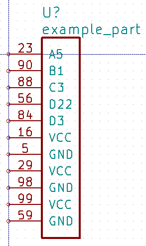
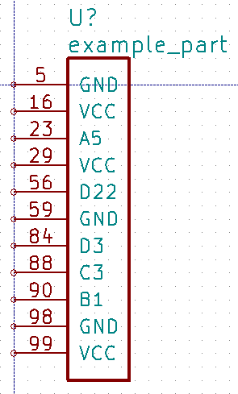
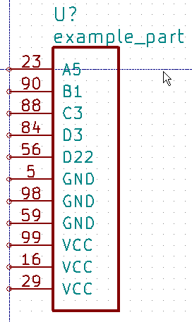
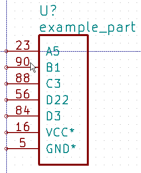
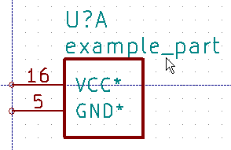
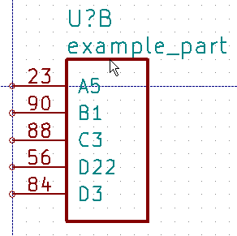
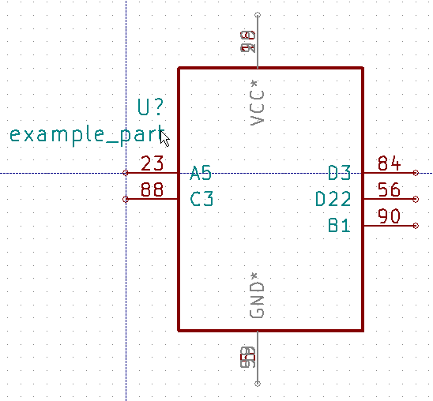

========
Usage
========

KiPart is mainly intended to be  used as a script::

    usage: kipart [-h] [-v] [-r [{generic,xilinx7,psoc5lp}]]
                       [-s [{row,num,name}]] [-o [file.lib]] [-f] [-b] [-a] [-w]
                       [-d [LEVEL]]
                       file1.[csv|zip] file2.[csv|zip] ... [file1.[csv|zip]
                       file2.[csv|zip] ... ...]

    Generate single & multi-unit schematic symbols for KiCad from a CSV file.

    positional arguments:
      file1.[csv|zip] file2.[csv|zip] ...
                            Files for parts in CSV format or as CSV files in .zip
                            archives.

    optional arguments:
      -h, --help            show this help message and exit
      -v, --version         show program's version number and exit
      -r [{generic,xilinx7,psoc5lp}], --reader [{generic,xilinx7,psoc5lp}]
                            Name of function for reading the CSV file.
      -s [{row,num,name}], --sort [{row,num,name}]
                            Sort the part pins by their entry order in the CSV
                            file, their pin number, or their pin name.
      -o [file.lib], --output [file.lib]
                            Generated KiCad library for part.
      -f, --fuzzy_match     Use approximate string matching when looking-up the
                            pin type, style and orientation.
      -b, --bundle          Bundle multiple pins with the same name into a single
                            schematic pin.
      -a, --append          Append to an existing part library.
      -w, --overwrite       Allow overwriting of an existing part library.
      -d [LEVEL], --debug [LEVEL]
                            Print debugging info. (Larger LEVEL means more info.)
                        
A generic part file is expected when the `-r generic` option is specified.
It contains the following items:

#. The part name or number stands alone on row.
#. The next non-blank row contains the column headers. The required headers are 'Pin' and 'Name'.
   Optional columns are 'Unit', 'Side', 'Type', and 'Style'.
   These can be placed in any order and in any column.
#. On each succeeding row, enter the pin number, name, unit identifier (if the schematic symbol will have multiple units),
   pin type and style. Each of these items should be entered in the column with the appropriate header.

   * Pin numbers can be either numeric (e.g., '69') if the part is a DIP or QFP, or they can be
     alphanumeric (e.g., 'C10') if a BGA or CSP is used. Placing a `*` at the start of a pin number
     creates a non-existent "gap" pin that can be used to divide the pins into groups. This only works
     when the `-s row` sorting option is selected.
   * Pin names can be any combination of letters, numbers and special characters (except a comma).
   * The unit identifier can be blank or any combination of letters, numbers and special characters (except a comma).
     A separate unit will be generated in the schematic symbol for each distinct unit identifier.
   * The side column specifies the side of the symbol the pin will be placed on. The allowable values are:
        * left
        * right
        * top
        * bottom
   * The type column specifies the electrical type of the pin. The allowable values are:
        * input, inp, in, clk
        * output, outp, out
        * bidirectional, bidir, bi, inout, io
        * tristate, tri
        * passive, pass
        * unspecified, un, analog
        * power_in, pwr_in, power, pwr, ground, gnd
        * power_out, pwr_out, pwr_o
        * open_collector, open_coll, oc
        * open_emitter, open_emit, oe
        * no_connect, no_conn, nc
   * The style column specifies the graphic representation of the pin. The allowable pin styles are:
        * line, <blank>
        * inverted, inv
        * clock, clk, rising_clk
        * inverted_clock, inv_clk
        * input_low, inp_low, in_lw, in_b
        * clock_low, clk_low, clk_lw_clk_b
        * output_low, outp_low, out_lw, out_b
        * falling_edge_clock, falling_clk
        * non_logic, nl, analog
#. A blank row ends the list of pins for the part.
#. Multiple parts (each consisting of name, column header and pin rows) 
   separated by blank lines are allowed in a single CSV file.
   Each part will become a separate symbol in the KiCad library.

When the option `-r xilinx7` is used, the individual CSV pin files or entire .zip archives
`for the Xilinx 7-Series FPGAs <http://www.xilinx.com/support/packagefiles/>`_ can be processed.

When the option `-r psoc5lp` is used, the CSV pin file contains the pinout text
extracted from a Cypress PSoC5LP datasheet.

The `-s` option specifies the arrangement of the pins in the schematic symbol:

* `-s row` places the pins in the order they were entered into the CSV file.
* `-s num` places the pins such that their pin numbers are in increasing order.
* `-s name` places the pins in increasing order of their names.

Specifying the `-f` option enables *fuzzy matching* on the pin types, styles and sides used in the
CSV file.
So, for example, `ck` would match `clk` or `rgt` would match `right`.

Specifying the `-b` option will place multiple pins with the identical names at the same location
such that they can all attach to the same net with a single connection.
This is helpful for handling the multiple VCC and GND pins found on many high pin-count devices.

Examples
-----------

Assume the following data for a single-unit part is placed into the `example.csv` file::

    example_part

    Pin,    Type,           Name
    23,     input,          A5
    90,     output,         B1
    88,     bidirectional,  C3
    56,     tristate,       D22
    84,     tristate,       D3
    16,     power_in,       VCC
    5,      power_in,       GND
    29,     power_in,       VCC
    98,     power_in,       GND
    99,     power_in,       VCC
    59,     power_in,       GND

Then the command `kipart example.csv -o example1.lib` will create a schematic symbol
where the pins are arranged in the order of the rows in the CSV file they are on:

The command `kipart -s num example.csv -o example2.lib` will create a schematic symbol
where the pins are arranged by their pin numbers:

The command `kipart -s name example.csv -o example3.lib` will create a schematic symbol
where the pins are arranged by their names:

The command `kipart -b example.csv -o example4.lib` will bundle power and no-connect pins with 
identical names (like `GND`, `VCC`, and `NC`) into single pins like so:

Or you could divide the part into two units: one for I/O pins and the other for power pins
by adding a `Unit` column like this::

    example_part

    Pin,    Unit,   Type,           Name
    23,     IO,     input,          A5
    90,     IO,     output,         B1
    88,     IO,     bidirectional,  C3
    56,     IO,     tristate,       D22
    84,     IO,     tristate,       D3
    16,     PWR,    power_in,       VCC
    5,      PWR,    power_in,       GND
    29,     PWR,    power_in,       VCC
    98,     PWR,    power_in,       GND
    99,     PWR,    power_in,       VCC
    59,     PWR,    power_in,       GND
    
Then the command `kipart -b example.csv -o example5.lib` results in a part symbol having two separate units:

As an alternative, you could go back to a single unit with all the inputs on the left side,
all the outputs on the right side, the `VCC` pins on the top and the `GND` pins on the bottom::

    example_part

    Pin,    Unit,   Type,           Name,   Side
    23,     1,      input,          A5,     left
    90,     1,      output,         B1,     right
    88,     1,      bidirectional,  C3,     left
    56,     1,      tristate,       D22,    right
    84,     1,      tristate,       D3,     right
    16,     1,      power_in,       VCC,    top
    5,      1,      power_in,       GND,    bottom
    29,     1,      power_in,       VCC,    top
    98,     1,      power_in,       GND,    bottom
    99,     1,      power_in,       VCC,    top
    59,     1,      power_in,       GND,    bottom
    
Running the command `kipart -b example.csv -o example6.lib` generates a part symbol with pins on all four sides:

